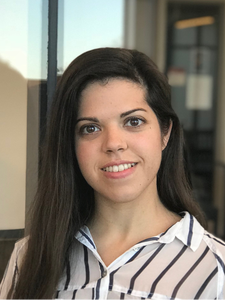
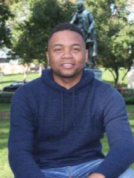
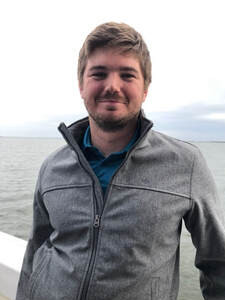
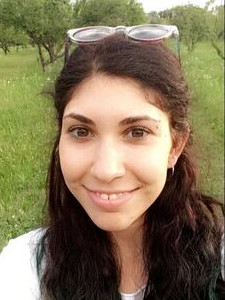
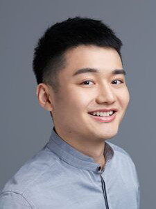
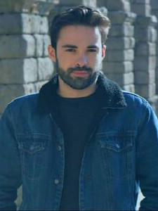

## Current members

<!-- Portfolio Gallery Grid -->
<!-- all images 225 x 300 --> 

<div class="row">
 <div class="column">
  <div class="content">
   
   <small_text>Laura Fernández Arroyo</small_text>
  </div>
 </div>
 <div class="column">
  <div class="content">
   
   <small_text>Juan José Garrido Pozú</small_text>
  </div>
 </div>
 <div class="column">
  <div class="content">
   
   <small_text>Kyle Parrish</small_text>
  </div>
 </div>
 <div class="column">
  <div class="content">
   
   <small_text>Gabriela Constantin-Dureci</small_text>
  </div>
 </div>
</div>


<div class="row">
 <div class="column">
  <div class="content">
   
   <small_text>Jiawei Shao</small_text>
  </div>
 </div>
 <div class="column">
  <div class="content">
   
   <small_text>Iván Andreu Rascón</small_text>
  </div>
 </div>
 <div class="column">
  <div class="content">
   
   <small_text>Isabelle Chang</small_text>
  </div>
 </div>
 <div class="column">
  <div class="content">
   
   <small_text>Katherine Taveras</small_text>
  </div>
 </div>
</div>


## Former members

- Avery Field (Aresty, Montclair State)
- Jack Fastenau (Lab assistant, New Jersey Medical School)
- Kimberly Gómez (Aresty lab assistant)

## Collaborators

- Dr. Miquel Simonet (University of Arizona)
- Dr. Nicole Rodríguez (Post-doc, Adam Mickiewicz University, Poznań, Poland)


## Directory

```{r, members, echo=F, layout="l-body-outset"}
tibble::tribble(
  ~'Name', ~'Role', ~'Email', ~'Website',
  "Joseph Casillas", "PI", "joseph.casillas@rutgers.edu", "[www.jvcasillas.com](https://www.jvcasillas.com)",
  "Laura Fernández", "PhD student", "lf402@spanport.rutgers.edu", "https://laurafdeza.github.io",
  "Juan José Garrido Pozu", "PhD student", "jjg280@scarletmail.rutgers.edu", " ",
  "Kyle Parrish", "PhD student", "kcp74@scarletmail.rutgers.edu", " ",
  "Gabriela Constantin-Dureci", "PhD student", "gabriela.constantin.dureci@rutgers.edu", " ",
  "Jiawei Shao", "PhD student", "js2845@scarletmail.rutgers.edu", " ",
  "Iván Andreu", "PhD student", "ia308@connect.rutgers.edu", " ",
  "Isabelle Chang", "Aresty assistant", "isc22@scarletmail.rutgers.edu", " ",
  "Katherine Taveras", "Aresty assistant", "kgtaveras@gmail.com", " ",
  ) |> 
  knitr::kable()
```


<style type="text/css">

small_text {
  font-size: .75em;
}

* {
  box-sizing: border-box;
}

body {
  background-color: #fff;
}

.row {
  margin: 8px -16px;
}

/* Add padding BETWEEN each column (if you want) */
.row,
.row > .column {
  padding: 8px;
}

/* Create four equal columns that floats next to each other */
.column {
  float: left;
  width: 50%;
}

/* Clear floats after rows */ 
.row:after {
  content: "";
  display: table;
  clear: both;
}

/* Content */
.content {
  background-color: white;
  padding: 10px;
}

/* Responsive layout - makes a two column-layout instead of four columns */
@media screen and (max-width: 900px) {
  .column {
    width: 25%;
  }
}

/* Responsive layout - makes the two columns stack on top of each other instead of next to each other */
@media screen and (max-width: 600px) {
  .column {
    width: 100%;
  }
}

</style>

